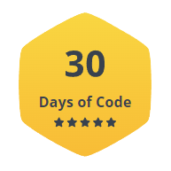

### Hello, I'm Ayush Prajapati 👋

- 🏫 Education:
    - Master of Applied Computing
        - University of Windsor (2022 - Present)
        
    - Bachelor's of Engineering in Information Technology (BE - IT)
        - Aditya Silver oak Institue of Technology (2018 - 2022)
        - Scored 9.40/10 CGPA

- 📫 How to reach me:
    - LinkedIn: https://www.linkedin.com/in/ayush-prajapati-b51bbb166/
    - Twitter: [@iayush_1211](https://twitter.com/iayush_1211?t=_qXJ2Vm5xcqpsmEO0Avdpg&s=09)
    - YouTube: [Ayush Prajapati](https://www.youtube.com/channel/UCUFXCEnX8Mhq_EEbYTWIJxQ/featured)
 
- 🚪 Checkout my Competitive Programming profiles:
    - HackerRank: [Ayush_1211](https://www.hackerrank.com/Ayush_1211)
    - LeetCode: [Ayush_1211](https://leetcode.com/Ayush_1211/)

- 🏅 Badges:

    
- 💻 Skills: 
    - Java
    - Python
    - Machine Learning
    - Javascript
    - PHP
 
