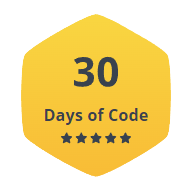

### Hello, I'm Ayush Prajapati 👋

- 🏫 Education:
    - Master of Applied Computing, Computer Science
        - University of Windsor (Sept 2022 - Dec 2023)
        
    - Bachelor of Engineering in Information Technology (BE - IT)
        - Aditya Silver Oak Institue of Technology (Aug 2018 - May 2022)
        - CGPA: 9.40/10
 
- 🚪 Checkout my Competitive Programming profiles:
    - HackerRank: [Ayush_1211](https://www.hackerrank.com/Ayush_1211)
    - LeetCode: [Ayush_1211](https://leetcode.com/Ayush_1211/)

- 🏅 Badges:

    
- 💻 Skills:
    - Python
    - R
    - SQL
    - Power BI
    - Tableau
    - Machine Learning
    - React.js
    - JavaScript
    - Java
    - PHP
 
